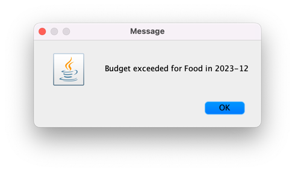
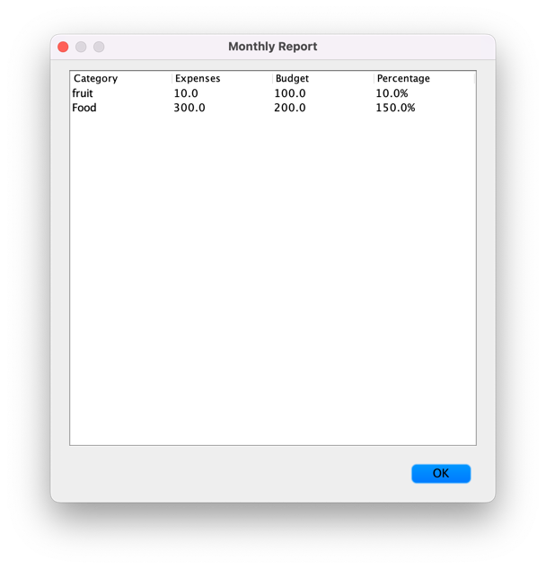

# Personal Finance Manager
## Description
Personal Finance Manager is a desktop application that helps users track and manage their finances. It provides a 
user-friendly interface for managing expenses and budget categories. The system allows users to add, browse, and delete 
expenses, as well as generate monthly reports, and it also supports the addition of new categories with a specified 
monthly budget. Besides, it includes a data saving feature, the expenses and categories can be stored in a local file 
and reconstructed later, allowing the user to maintain their financial records over time.

## Features
There are 4 main features in this application:
#### Add Expense:
In this feature, the user can add an expense with details, including its name, amount, category, year, month, and 
description, the user can also create a category with a monthly budget in this part. Here are some images of this 
process:

Also, if the current spending for 
that category is over budget, the Financial Manager will show an alert message:

#### Browse Expenses:
In this feature, the user can view a table of all the expenses with the details, including their name, amount, category, 
date and description.

#### Delete Expense:
In this feature, the user can choose from the existing expenses and delete them.

#### Monthly Report
In this feature, the user will select a specific year and month first, and then the corresponding monthly report is 
shown. Different from the Browse Expense part, it will not show every expense from that month, it will calculate the 
total expenses per category and the budget for that category, and demonstrate the current spending as a percentage of 
the category budget.

Besides, the Finance Manager can store the added expense to a local file, as well as the categories and the budget. 
Each time the user adds or deletes an expense, it will update this file. As the user exits the application, these 
records will be stored and when the user comes back next time, it will be reloaded.

## Goals
The primary goal of this project is to provide a simple and efficient tool for personal financial management. It aims to
help users track their expenses, manage their budgets, and gain an understanding of their spending habits. It 
demonstrates the use of various concepts such as object-oriented programming, GUI development with Swing, and file I/O 
for data persistence.